```{r setup, include=FALSE}
knitr::opts_chunk$set(echo = FALSE)
```

1. Critiques For The Original Visualization  
  The current visualization can be found at Chart 6 Resident labour force by age in MOM's Report: Labour Force in Singapore 2019 to indetify possible areas of improvement.
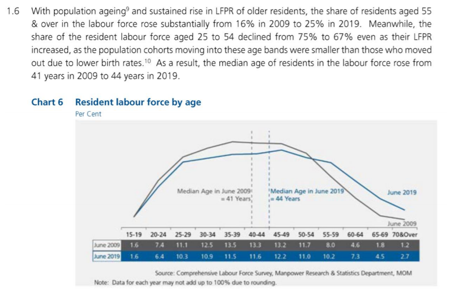
1.1 Clarity Issues
  
  (1)The information of axis below is inconvenient to combine with the line in the graph. Since the X axis is intervals and the graph is based on lines, it is hard to know which point of the line refers to the axis below. In this case, a bar chart maybe a better option to matach the information more clearly.
 
  (2)The upper paragraph reveals some insights and trends of the chart. For instance, it said that the share of residents aged 55 & over rose from 16% in 2009 to 25% in 2019. However, it is not so straightforward for readers because they have to add the data up by themselves. 

  (3)The title of the chart is "Resident labour force by age". For the information that we can tell from this chart, this title is too general to convey the exact information. "Resident labour force by age" may want to show that the numbers of labour in different age groups, not exactly the labour participation rate in different age groups.
  
  (4)The note below is not so conspicuous for readers, and this may cause confusion since the sum of the data is not exact 100.

1.2 Aesthetics Issues
  
  (1)The colour is not so conspicuous to catch readers' eyes. And also can not tell which information is more important than others through this colour setting.
  
  (2)The "Percent" is under the title, which should be added right next to the axis.
  
  (3)Too much words in the middle of the chart, which is distracting and confusing.

2. Proposed Design
  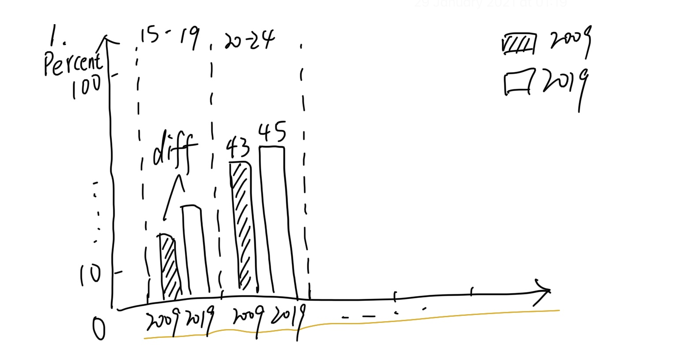
  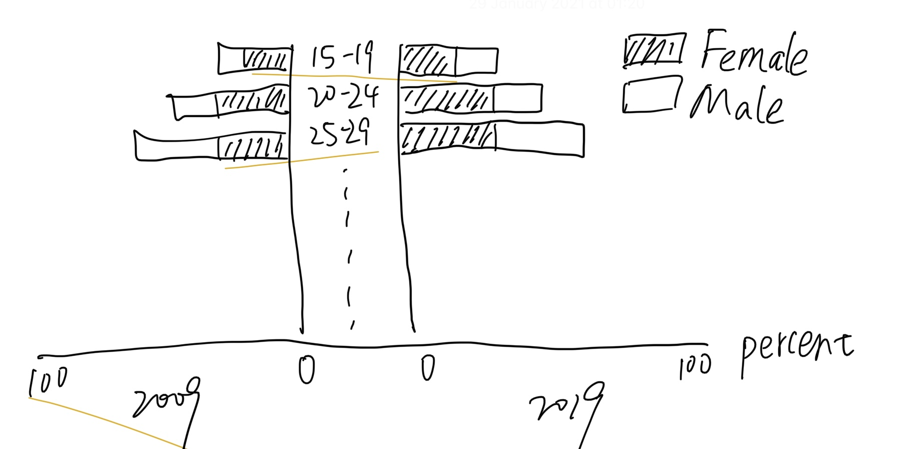
    Comparing to the original chart, the first barchart is more clear to refer the data to the interval since they are barcharts, and also the tag on each bar can tell the exact value so there is no need to read other tables. Also the bars in each interval is easier to compare the difference since there is no longger lines in the chart. What's more, I'll add colour on the bars to indicate whether the difference between 2009 and 2019 is postivie or not, and increase/decrease by what degree, which can be told by the drakness of the colour(i.e. If the difference is larger, the colour will be darker).
    The second chart is to tell the difference and changes based on sex factor. Through this chart, readers can easily know that which the participation rate structures of the age groups are actually changing.

3. Step-by-step Description

3.1 Data Preparation
  Initially, the data was designed to be shown in Excel, so we need to do some transformations of the format in order that this file can be loaded properly by Tableau.
  And the data after reorganization are as below:
  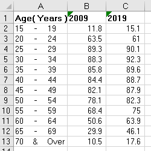
  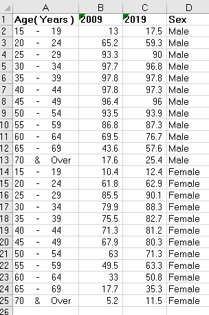

3.2 Import file into Tableau
  After loading this revised data into Tableau, there are two sheets will be used in future charts. And I combined these two sheets with "Age" relationship.
  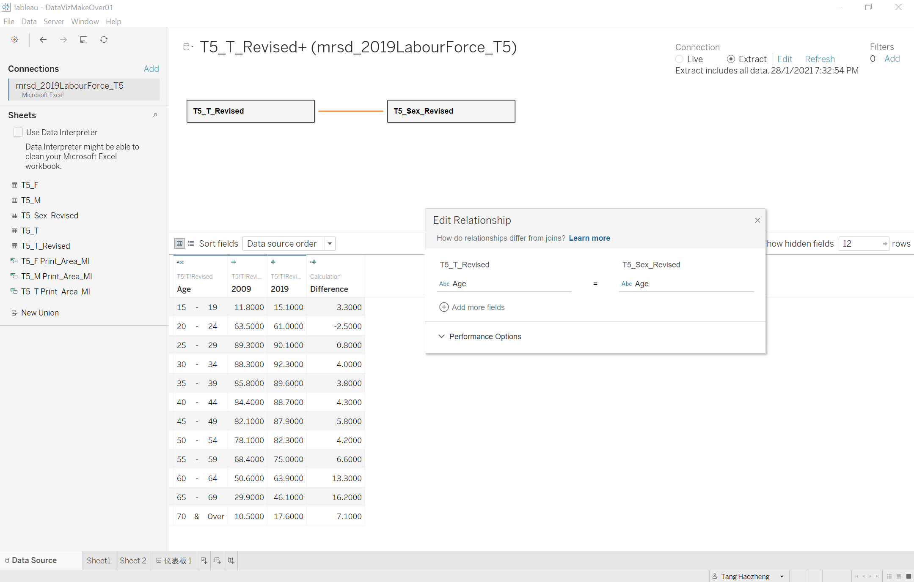
  
3.3 Sheet 1 Side-by-side Barchart
  For the total Resident Labour Participation Rate, I use the side-by-side barchart and put data in 2009 and 2019 together to condust the comparison. The whole structure of the chart is as below:
  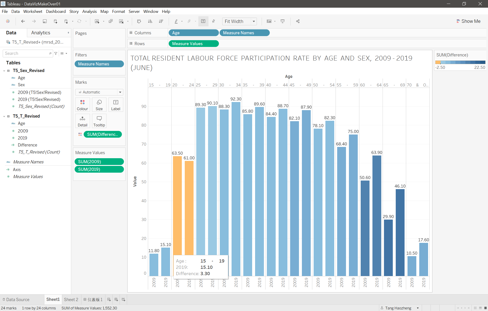
  Furthermore, I created a calculated field to get the difference of data between 2009 and 2019 to provide a more straightforward way for readers to catch the information. The calculated field is written as below:
  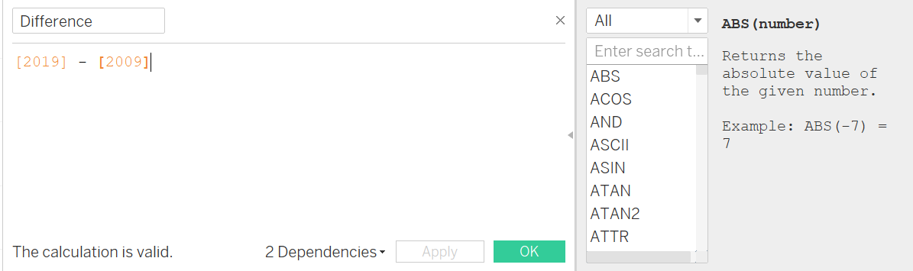
  Then I put the "Difference" into colour panel to filter the chart. Also the colour panel needs to be set as 0 centric since we are concerned about if the difference is positive or negative.
  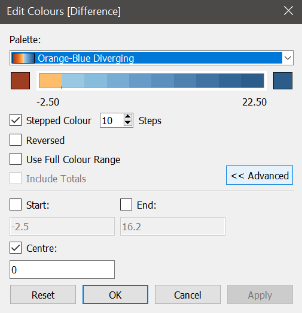
  I also set the colour steps as 10 to make it more clear that which age groups actually has the most changes in the participation rate.
  
3.4 Sheet 2 Horizontal Barchart
  The second sheet is to better reveal the difference of Labour Force Participation Rate between males and females in both 2009 and 2019. The structure is as below:
  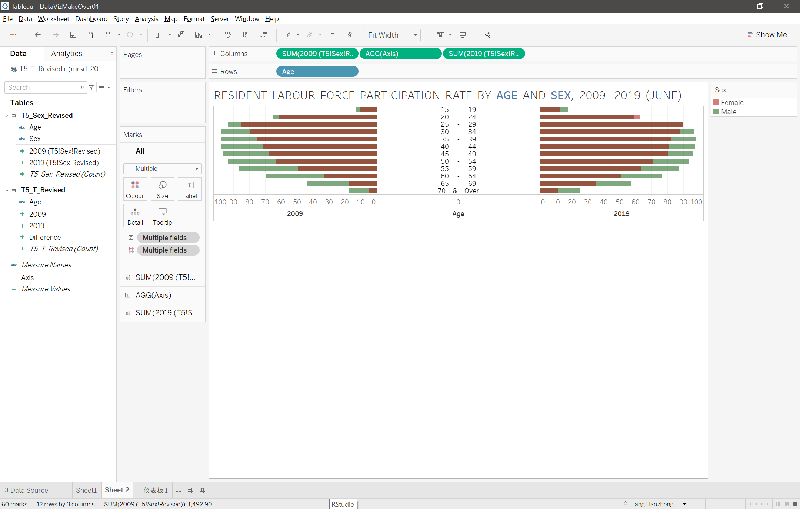
  I put the data in 2009 and 2019 together then chose Horizontal Barchart, and reverse the left part of the chart and switch off the Stack Marks. Then need to put "Sex" into colour panel to differentiate data in males and females. After that, to make it more convenient to read, I create a calculated field edited as below in order to build a new horizontal axis in the middle of the chart:
 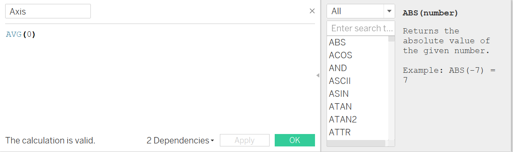
  Then I drag this "Axis" into column field and put it between SUM(2009) and SUM(2019).
Next, in "Axis" panel, I put the "Age" into Text to make this axis the same as original Y axis.
   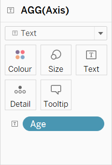
   The last step is to switch off the "show header" function under "Age" in column field.

3.5 The Dashboard
  
  To present these two charts, I create a dashboard to put them together for better reading experince, and the layout is as below:
   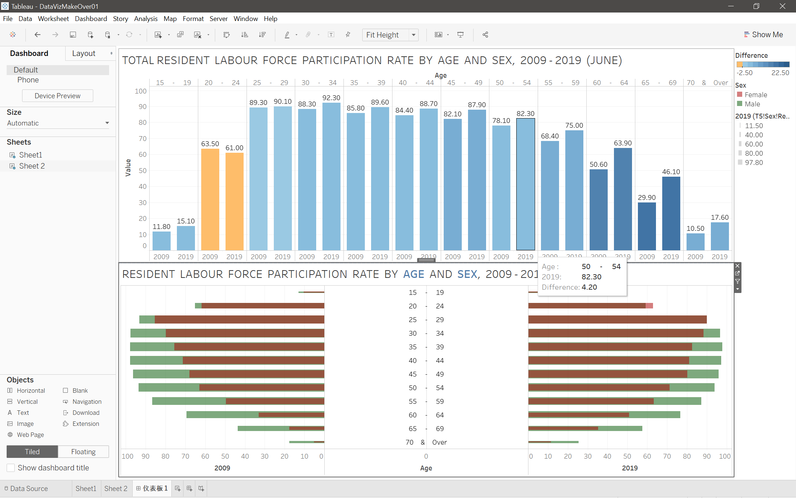
  
4. Major Observations
  
  In Total Resident Labour Force Participation Rate in 2009 and 2019:
  
  (1)Age group 20-24 is the only one that the rate in 2019 is lower than the one in 2009.
  
  (2)Age group 60-64 and 65-69 have the largest difference in 2009 and 2019, and both of them is increased by more than 10 percent.
  
  (3)According to the above observations, it seems that young labour force participation rate is slightly decreased or keep the same while elder one has a much apparent increasing trend.
  
  In Resident Labour Force Participation Rate By Age and Group in 2009 and 2019:
  
  (1)The female participation rate in age group 20-24 is the only one that is higher than males.
  
  (2)Overall, the female participation rate increased more than males, which means more female are actually going to work in the past decade in 2019.

