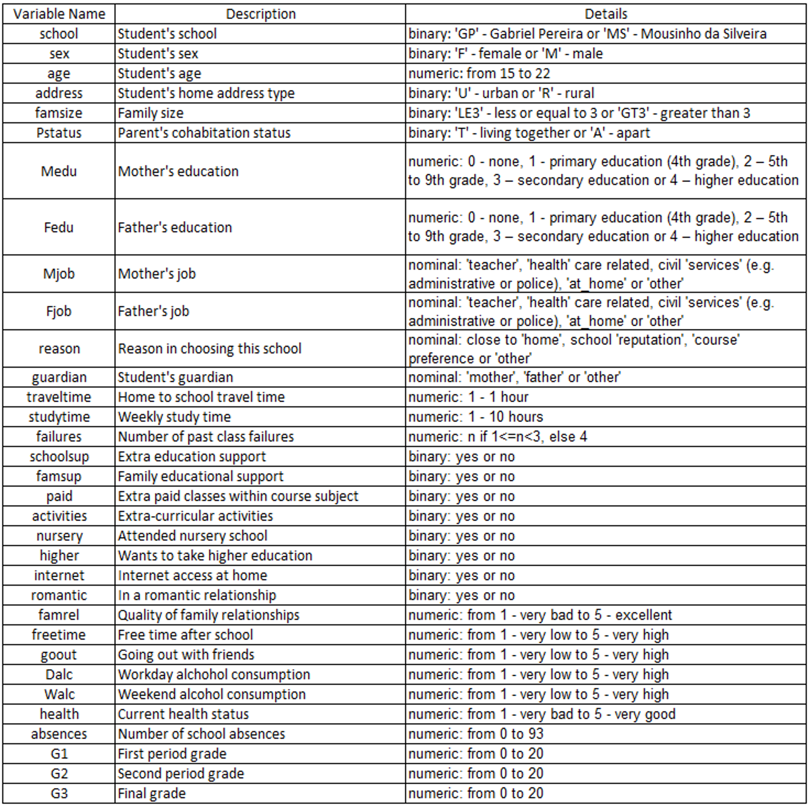
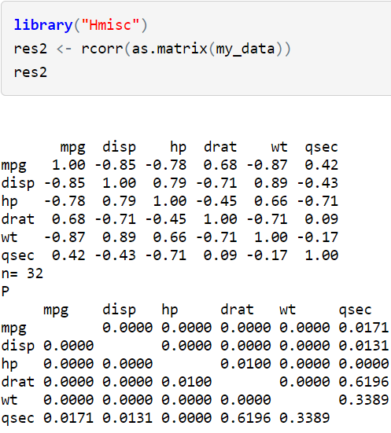
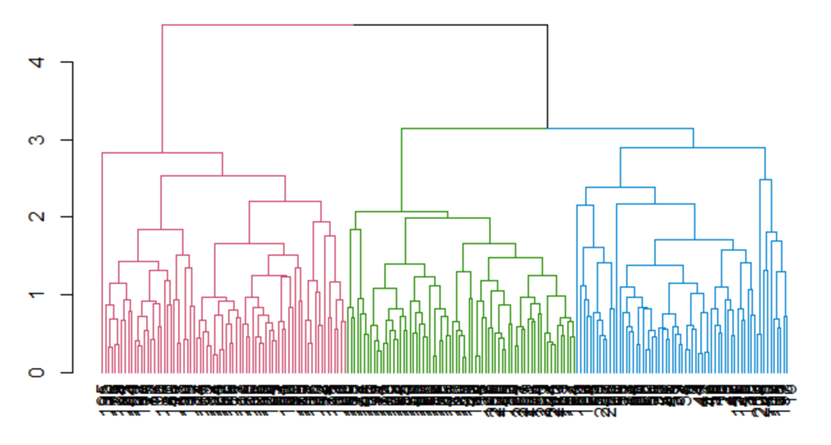
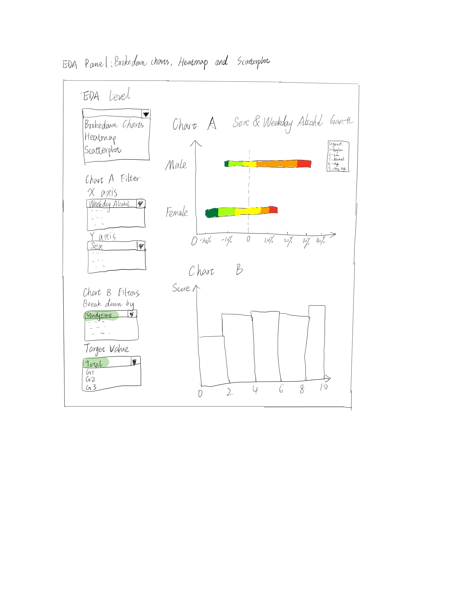
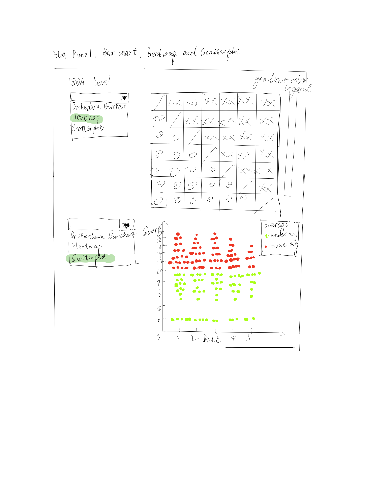
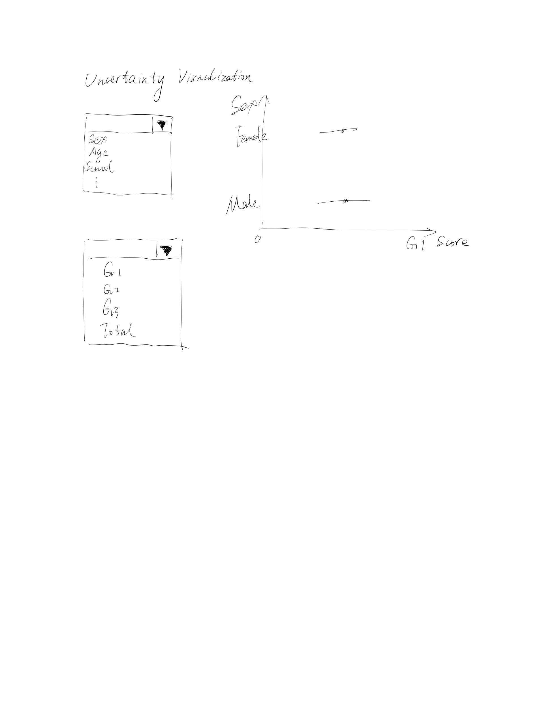
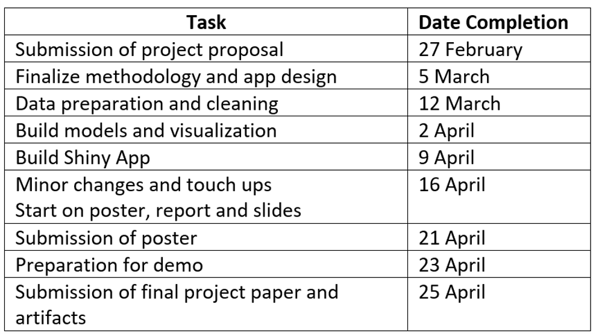

## Introduction

Around the world, there is always an emphasis on education, for example, to ensure education is available and affordable to all, to improve the method of education. This is because through the study of education, it can be observed that having a good education leads to better general well-being, such as healthier lifestyles, employment opportunities, career progression and lower tendencies to commit crime. 


While there are many factors that can impact a person’s academic performance, family background and one’s lifestyle are two of the larger factors. The influence of family background may include financial status in the family’s ability to provide educational support, stability at home to provide emotional and mental support, among others. On the other hand, one’s lifestyle choices such as what he or she chooses to do during their free time, amount of time they spend on studying has very direct impact on one’s grades.

## Motivation

Since there are many sub-factors in family background and lifestyle choices, the motivation of this study is hence to look deeper at these sub-factors to see which are the factors that have a greater correlation in the impact on a student’s grades. 

More specifically, this study aims to study the correlation between each factor and a student’s grades, as well as aiming to build a model that can accurately determine the academic performance of a student. From the findings, targeted help may be administered to students in these specific areas attributing to poor grades in school, therein helping them have a higher chance of a better future. 

## Data Set and Preparation

The data set used in this report is from [Kaggle](https://www.kaggle.com/uciml/student-alcohol-consumption?select=student-mat.csv), which was obtained from a survey of Portuguese students aged 15 to 22 from mathematics and Portuguese language course. As there were students from attending both courses, these duplicates of 39 entries were removed, leaving a total of 1005 data points. The data was obtained through a survey on family demographics, lifestyle factors, along with their grades in mathematics and Portuguese language. Asides from the school, gender, and age, the other 27 variables can be broadly classified into family demographics and lifestyle factors. In the data set, which is a csv file, the following variables are presented, which will undergo further data cleaning and data preparation for analysis and visualization:

```{r echo=FALSE, message=FALSE, warning=FALSE, paged.print=FALSE}

```

## Methodology and Approach

<font size = 4>Regression or Decision Tree</font>

1.	Selection based on correlation

First, we need to exclude factors with relatively strong positive/negative correlations with absolute value of correlation coefficients greater than 0.7. This is because these factors with strong correlations cause a lower accuracy of our regression model.
We will use a correlation matrix to achieve it. Below is an example of testing correlation using correlation matrix in R. In this case, we will use rcorr function in Hmisc package.

```{r echo=FALSE, message=FALSE, warning=FALSE, paged.print=FALSE}

```

2.  Logistic/Multiple Linear Regression or Decision Tree

Currently we are not sure which model is more suitable for our data. Theoretically, all these three models are applicable for our data. Hence, in this case we decide to conduct these three models above and later we can decide which one to use by comparing R square. 

<font size = 4>Hierarchical Clustering</font>

In data mining and statistics, hierarchical clustering (also called hierarchical cluster analysis or HCA) is a method of cluster analysis which seeks to build a hierarchy of clusters. In our project, we aim to classify the respondents into different clusters based on their personal information, so that we have a better understanding that which group of students share the similar characteristics. Through hierarchical clustering and dendrogram functions in R, we can get a clear and comprehensible visualization based on the hierarchical clustering algorithm.

```{r echo=FALSE, message=FALSE, warning=FALSE, paged.print=FALSE}

```

<font size = 4>EDA Visualizations</font>

Besides the models we plan to use above, we also provide EDA for our project. And the proposed dashboard design is shown as below:

```{r echo=FALSE, message=FALSE, warning=FALSE, paged.print=FALSE}

```

```{r echo=FALSE, message=FALSE, warning=FALSE, paged.print=FALSE}

```

```{r echo=FALSE, message=FALSE, warning=FALSE, paged.print=FALSE}

```

## Timeline

```{r echo=FALSE, message=FALSE, warning=FALSE, paged.print=FALSE}

```


```{r setup, include=FALSE}
knitr::opts_chunk$set(echo = FALSE)
```


