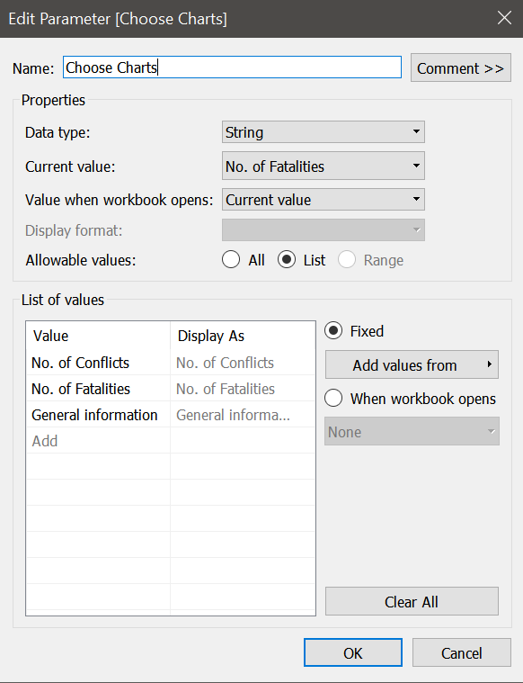
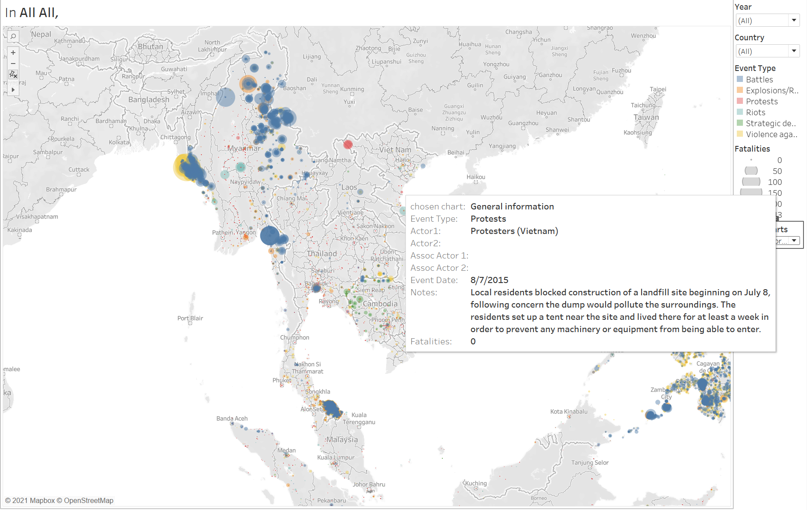

```{r setup, include=FALSE}
knitr::opts_chunk$set(echo = FALSE)
```

<font size=5>1. Critiques For The Original Visualization</font>


  The current visualization can be found at below picture. The purpose of this chart is to reveal the overall situation of conflicts in South-East Asia region. And for this purpose, there are sevral improvements.

<font size=4>1.1 Clarity Issues</font>

(1)For the map, the points are totally opaque, hence when there are overlapping points, it is hard for viewers to realize how many events happened in the area indeed.

(2)For the tooltip of the points on the map, there is no need to add longitude and latitude there since viewers are not interested and not aware of the exact coordinates. Also, the event ID showed is also confusing for viewers because they would not understand the meaning of the code. And as these two issues, the information that the map conveyed is very poor and unhelpful for viewers.

(3)For the line chart, it is unclear and no meanings for viewers to use "count of sheet1" as the title of y axis.

(4)The title of x axis is "Event Data" while the value of x axis is in years.

(5)Also, since color is already used as filter to differentiate the event types, there is no need to use separate line charts to indicate different event types. What's more, the color of the line chart is all blue, therefore, it is unclear for viewers since the legend is here and blue refers to "Battles".

(6)From the point of my view, line charts are worse than bar chart. Because it only reveals the total number of each event happened, while it can not reveal the component structure of the events happened in a period.

<font size=4>1.2 Aesthetics Issues</font>

(1)The structure of the line graph is too simple and make viewers think the information is kind of poor.

(2)The font size and color of the titles in the line graph is small and indistinct.

(3)The y axis of each line is not synchronized. It is hard for viewers to compare the numbers betweem different event types.

(4)For some filtered results, the line chart is kind of uncomfortable for viewers. For example, this line disappears in 2017 and 2020 since the value of these years is zero.


<font size=4>1.3 Interactivity Issues</font>

(1)The country filters is in single value list, hence it is impossible for viewers to select specific countries to do comparison.

(2)There is no filter for years so it is hard for viewers to focus on the events happened in selected year or years.

<font size=5>2. Proposed Design</font>


Comparing to the original visualization, the proposed design overcome several issues:

(1)"Years" is added as a filter in order that viewers can select the year or years that they want to focus on. Also, "Country" filter is set as multi value list so viewers can select different countries to do comparison.

(2)For the "General Information" part, more useful information are added into the tooltip, which allows viewers to acknowledge more about the event. And the size of the circle is differentiated by the fatalities hence viewers can have a straightforward understanding of the severeness of the event. More importantly, I set the opacity of the circle to be 45% so it is clearer even if there is overlapping.

(3)For the "No. of Conflicts" and "No. of Fatalities" parts, bar charts are added to make it more clear for viewers to know the event numbers and also structures in different countries. Since the difference of each country is relatively large so I did not add any reference line in the chart.

<font size=5>3. Tableau Dashboard</font>


<font size=5>4. Step-by-step Description</font>

<font size=4>4.1 Importing data into Tableau</font>

The data is already well structured so there is no need to change any content or format of the original csv file. Directly load the data into tableau.


<font size=4>4.2 For the "General Information" part</font>

First of all, we drag the existed measure value "Longitude" on columns and "Latitude" on rows instead of using the longitude and latitude that talbeau automatically generatede for us.


Then we drag "Event Id Cnty" to detail and the graph should look like as below:


Then we drag other measure names into the Marks to enrich the information of each circle. 


And your graph should like this:


Next, we need to add filters into the graph to make it more flexible for viewers. In this step, we want to enable viewers to select different countries and year(s). 


Now viewers can select countries and year(s) they are interested in. Further we will still use filters to switch different charts in dashboard.

What's more, for the clarity, we need to change the opacity of the circle.


Now the first chart of "General Information" is already completed.

<font size=4>4.3 For the "No. of Conflicts" and "No. of Fatalities" parts</font>

Since the steps are very similar, we put these two sheets in one section. First for the "No. of Conflicts", we need to create a calculation field to sum the total number of conflicts.


Then we also put "Longitude" and "Latitude" into columns and rows respectively. Next, we put the calculation field that we just created into color panel and "Country" into lable panel. Your graph should look like this:


For the "No. of Fatalities" part we do the same steps except we put "Fatalities" into color panel. And your graph should like this:


Now we have completed these two parts.

<font size=4>4.4 For the "Conflicts bar chart" and "Fatalities bar chart" parts</font>

These two graphs are also basically the same so we will do them together. First for the "Conflicts bar chart", we put the calculation field "sum conflict" and Country into rows while put Years into columns.
After that, we drag event type into color panel. In addition, we need to change the format of the country header to make it more clear and change the row title into "Total conflicts". Now your graph should look like as below:


For the "Fatalities bar chart", we do the same steps except we use "Fatalities" to replace the "sum conflict" in rows. And also we need to change the format of the country headers.


<font size=4>4.5 Dashboard preparation and design</font>

For the dashboard, we want to switch different charts through different options and make the filters apply to all the related charts. To achieve this, we need do some preparation before we design the dashboard.

First, we need to create a parameter as below to provide different options for the charts.



Then we need create a calculation field using the parameter we just created. And we name it as "chosen chart".


Next, we drag the "chosen chart" into filters panel for all the charts respectively. Importantly we also need to add this filter for "Conflict bar chart" and "Fatalities bar chart" because we want them to appear when "No. of Conflicts" and "No. of Fatalities" are chosen.


Now it comes to set the filters to make them apply to related charts. In this case, we want to country filter to apply to "Conflicts bar chart" and "Fatalities bar chart", and year filter apply to "No. of Conflicts" and "No. of Fatalities". So we set as below:


Now we have completed all the preparation, we can start design the dashboard. First we need to drag the "Vertical" to the dashboard. Then we drag "General Information" sheet into it. Now it appears like this:



Next we need to hide the title since it is not helpful and will impact other sheets.


Now the "General Information" part is done, we change the filter to switch to "No. of Conflicts".


In this blank space, we drag the "No. of Conflicts" and "Conflict bar chart" sheets into it like this:


Then we switch to the "No. of Fatalities" and do the same steps as above. Now we have basically done the design work of our dashboard. You can also do some changes of the layout to make it more clear and comfortable for users.

<font size=5>5. Major Observations</font>

(1)


From this graph we can see that during 2010-2020, the conflicts in South-east Asia mostly happened in Philippines while the most severe conflicts happened in Myanmar. Hence, further we will focus on these two countries since they have the most apparent characteristics. What's more important, we can discover some regions where conflicts usually happened. For example, the north, east, and west Myanmar that are cloesd to boarders, also south Thailand near to Malaysia and the whole Philippines.

(2)


From this graph we can see that in South-east Asia, conflicts are mainly in Philippines, Myanmar, Thailand, and Indonesia. The rest region has relatively less conflicts and there are no conflicts happened in Singapore between 2010 and 2020.

(3)


From this graph we can see that most fatalities are occurred in Philippines since it has the most conflicts. And the second severest is Myanmar since the scale of the conflict is relatively larger. Except these two countries, the fatalities of rest is much more less.

(4)


In these two charts, we focus on the conflicts and fatalities in Philippines. We can see that for conflicts, there are none conflicts happened, while since 2016, there are a great numbers of conflicts but after 2016 the number is going down. And the main types of the conflicts are violence against civilians and battles. For fatalities, main fatalities is casued by these two types of conflicts.

(5)


In these two charts, we focus on the conflicts and fatalities in Myanmar. We can see that the conflicts trend is unstable and most of the conflicts are battles while in 2017 there are much more violence against civilians than other years. And also we can see that in 2016 despite the number of violence against civilians is low but the fatalities caused is much higher than other events.

