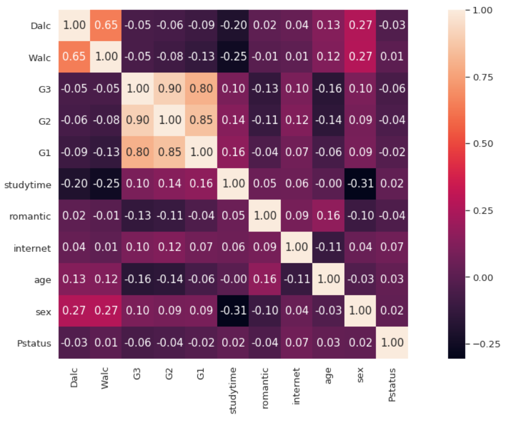
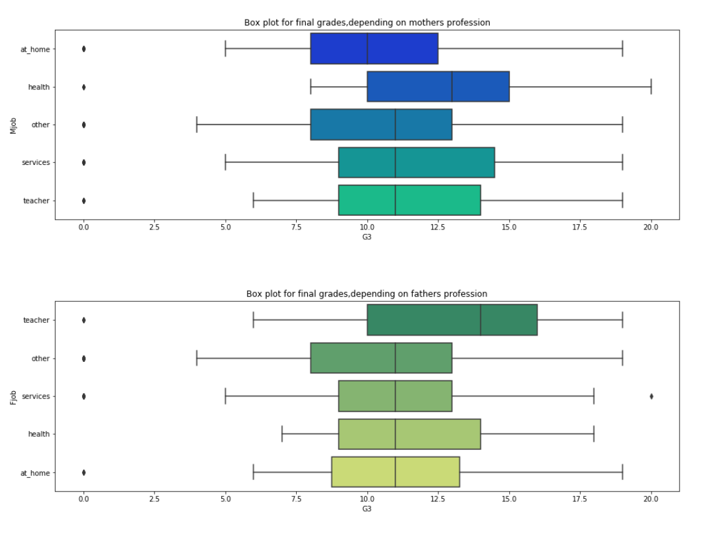
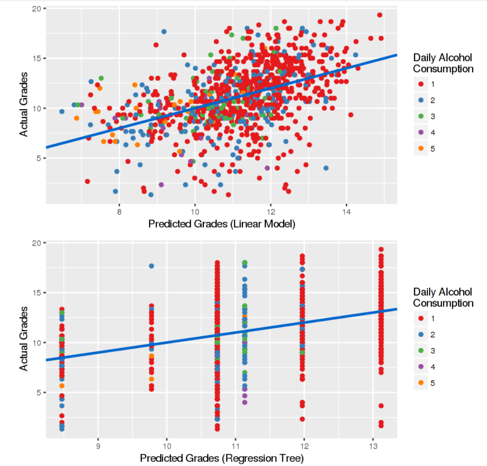

```{r setup, include=FALSE}
knitr::opts_chunk$set(echo = FALSE)
```
<font size=5>1.Introduction</font>

  This report is to conduct cluster analysis for our group project. In order to find out what are the factors that have great impact on students' grades, we decided to use this data source to build different models to see the reasons behind grades. The data were obtained in a survey of students math and portuguese language courses in secondary school in Portugal. It contains a lot of interesting social, gender and study information about students.

<font size=5>2.Literature Review</font>

  In the existing visualization analysis of this dataset, most of them only conducted EDA analysis such as boxplot, scatterplot, and heatmap. Some of them conducted linear regression, however, the result is not sastisfying. 
  
  
  
  
  
  
  
  From above we can see that either the visualization is too simple to convey rich information, or the regression result is still need to be improved. And the reasons why these visualization failed to transmit more useful information are:
  
  First we find out the data preparation is not enough. Since the subject and school of the survey is different, we should split the data set by school and subject respectively. That is to say, we should reorganize the data into four groups: 'GP'(Gabriel Pereira)-Math, 'GP'-Portuguese, 'MS'(Mousinho da Silveira)-Math, and 'MS'-Portuguese. By doing this, we can ensure that students are from the same school and doing the same subject so that only the lifestyle choices can be the only factors that impacts the final grades.
  
  Secondly, these visualizations are poor in interactivity. Besides that the visualizations themselves are not powerful enough to straightforwardly convey useful information, viewers are not able to select the different variables they are interested in. In our project, we aim to realize that viewers can select the variables they find vital to do further analysis. 
  
<font size=5>3.Data Preparation</font>
  
  First, we need to install and library all the packages that will be needed in this report. This code chunk is able to realize this in a more efficient way:

```{r echo=TRUE, message=FALSE, warning=FALSE}
packages = c('readr', 'dplyr', 'tidyverse', 'plyr', 'cluster', 'factoextra', 'dendextend',
             'seriation', 'heatmaply')
for(p in packages){
  if(!require(p,character.only = T)){
    install.packages(p)
  }
  library(p,character.only = T)
}
```

  Then we load the data into the R studio. The data set we use is from Kaggle, which contains two csv files, student-mat.csv and student-por.csv.

```{r echo=TRUE, message=TRUE}
data_all <- list.files(path = "data",
                       pattern = "*.csv", full.names = TRUE) %>% 
  lapply(read_csv) %>%                                          
  bind_rows 

data_cleaned <- data_all
show(data_cleaned)
```

  And after we load the data we can have a better view of its structure.
  
  The attributes for both student-mat.csv (Math course) and student-por.csv (Portuguese language course) datasets:

school - student's school (binary: 'GP' - Gabriel Pereira or 'MS' - Mousinho da Silveira)

sex - student's sex (binary: 'F' - female or 'M' - male)

age - student's age (numeric: from 15 to 22)

address - student's home address type (binary: 'U' - urban or 'R' - rural)

famsize - family size (binary: 'LE3' - less or equal to 3 or 'GT3' - greater than 3)

Pstatus - parent's cohabitation status (binary: 'T' - living together or 'A' - apart)

Medu - mother's education (numeric: 0 - none, 1 - primary education (4th grade), 2 – 5th to 9th grade, 3 – secondary education or 4 – higher education)

Fedu - father's education (numeric: 0 - none, 1 - primary education (4th grade), 2 – 5th to 9th grade, 3 – secondary education or 4 – higher education)

Mjob - mother's job (nominal: 'teacher', 'health' care related, civil 'services' (e.g. administrative or police), 'at_home' or 'other')

Fjob - father's job (nominal: 'teacher', 'health' care related, civil 'services' (e.g. administrative or police), 'at_home' or 'other')

reason - reason to choose this school (nominal: close to 'home', school 'reputation', 'course' preference or 'other')

guardian - student's guardian (nominal: 'mother', 'father' or 'other')

traveltime - home to school travel time (numeric: 1 - 1 hour)

studytime - weekly study time (numeric: 1 - 10 hours)

failures - number of past class failures (numeric: n if 1<=n<3, else 4)

schoolsup - extra educational support (binary: yes or no)

famsup - family educational support (binary: yes or no)

paid - extra paid classes within the course subject (Math or Portuguese) (binary: yes or no)

activities - extra-curricular activities (binary: yes or no)

nursery - attended nursery school (binary: yes or no)

higher - wants to take higher education (binary: yes or no)

internet - Internet access at home (binary: yes or no)

romantic - with a romantic relationship (binary: yes or no)

famrel - quality of family relationships (numeric: from 1 - very bad to 5 - excellent)

freetime - free time after school (numeric: from 1 - very low to 5 - very high)

goout - going out with friends (numeric: from 1 - very low to 5 - very high)

Dalc - workday alcohol consumption (numeric: from 1 - very low to 5 - very high)

Walc - weekend alcohol consumption (numeric: from 1 - very low to 5 - very high)

health - current health status (numeric: from 1 - very bad to 5 - very good)

absences - number of school absences (numeric: from 0 to 93)

These grades are related with the course subject, Math or Portuguese:

G1 - first period grade (numeric: from 0 to 20)

G2 - second period grade (numeric: from 0 to 20)

G3 - final grade (numeric: from 0 to 20, output target)
  
We can see that there are a lot observations are in text format, hence we need to convert them into appropriate data type. For variables in text format, we need to convert them into dummy values and for those scaled variables we need transform into ordinal data since they are considered as numercial data by default.

```{r echo=TRUE}
data_cleaned$school <- revalue(data_cleaned$school, c("GP" = 0))
data_cleaned$school <- revalue(data_cleaned$school, c("MS" = 1))
data_cleaned$school <- as.factor(data_cleaned$school)

data_cleaned$sex <- revalue(data_cleaned$sex, c("F" = 0))#female
data_cleaned$sex <- revalue(data_cleaned$sex, c("M" = 1))#male
data_cleaned$sex <- as.factor(data_cleaned$sex)

data_cleaned$famsize <- revalue(data_cleaned$famsize, c("LE3" = 0))#less or equal to 3
data_cleaned$famsize <- revalue(data_cleaned$famsize, c("GT3" = 1))#greater than 3
data_cleaned$famsize <- as.factor(data_cleaned$famsize)

data_cleaned$Pstatus <- revalue(data_cleaned$Pstatus, c("T" = 0))#living together
data_cleaned$Pstatus <- revalue(data_cleaned$Pstatus, c("A" = 1))#apart
data_cleaned$Pstatus <- as.factor(data_cleaned$Pstatus)

data_cleaned$reason <- revalue(data_cleaned$reason, c("home" = 0))#close to home
data_cleaned$reason <- revalue(data_cleaned$reason, c("reputation" = 1))
data_cleaned$reason <- revalue(data_cleaned$reason, c("course" = 2))
data_cleaned$reason <- revalue(data_cleaned$reason, c("other" = 3))
data_cleaned$reason <- as.factor(data_cleaned$reason)

data_cleaned$guardian <- revalue(data_cleaned$guardian, c("mother" = 0))
data_cleaned$guardian <- revalue(data_cleaned$guardian, c("father" = 1))
data_cleaned$guardian <- revalue(data_cleaned$guardian, c("other" = 2))
data_cleaned$guardian <- as.factor(data_cleaned$guardian)

data_cleaned$schoolsup <- revalue(data_cleaned$schoolsup, c("no" = 0))
data_cleaned$schoolsup <- revalue(data_cleaned$schoolsup, c("yes" = 1))
data_cleaned$schoolsup <- as.factor(data_cleaned$schoolsup)

data_cleaned$famsup <- revalue(data_cleaned$famsup, c("no" = 0))
data_cleaned$famsup <- revalue(data_cleaned$famsup, c("yes" = 1))
data_cleaned$famsup <- as.factor(data_cleaned$famsup)

data_cleaned$paid <- revalue(data_cleaned$paid, c("no" = 0))
data_cleaned$paid <- revalue(data_cleaned$paid, c("yes" = 1))
data_cleaned$paid <- as.factor(data_cleaned$paid)

data_cleaned$activities <- revalue(data_cleaned$activities, c("no" = 0))
data_cleaned$activities <- revalue(data_cleaned$activities, c("yes" = 1))
data_cleaned$activities <- as.factor(data_cleaned$activities)

data_cleaned$nursery <- revalue(data_cleaned$nursery, c("no" = 0))
data_cleaned$nursery <- revalue(data_cleaned$nursery, c("yes" = 1))
data_cleaned$nursery <- as.factor(data_cleaned$nursery)

data_cleaned$higher <- revalue(data_cleaned$higher, c("no" = 0))
data_cleaned$higher <- revalue(data_cleaned$higher, c("yes" = 1))
data_cleaned$higher <- as.factor(data_cleaned$higher)

data_cleaned$internet <- revalue(data_cleaned$internet, c("no" = 0))
data_cleaned$internet <- revalue(data_cleaned$internet, c("yes" = 1))
data_cleaned$internet <- as.factor(data_cleaned$internet)

data_cleaned$romantic <- revalue(data_cleaned$romantic, c("no" = 0))
data_cleaned$romantic <- revalue(data_cleaned$romantic, c("yes" = 1))
data_cleaned$romantic <- as.factor(data_cleaned$romantic)

data_cleaned$Medu <- factor(data_cleaned$Medu, order = TRUE,
                            levels = c("0", "1", "2", "3", "4"))

data_cleaned$Fedu <- factor(data_cleaned$Fedu, order = TRUE,
                            levels = c("0", "1", "2", "3", "4"))

data_cleaned$failures <- factor(data_cleaned$failures, order = TRUE,
                            levels = c("0", "1", "2", "3"))

data_cleaned$famrel <- factor(data_cleaned$Medu, order = TRUE,
                            levels = c("1", "2", "3", "4", "5"))

data_cleaned$freetime <- factor(data_cleaned$freetime, order = TRUE,
                            levels = c("1", "2", "3", "4", "5"))

data_cleaned$goout <- factor(data_cleaned$goout, order = TRUE,
                            levels = c("1", "2", "3", "4", "5"))

data_cleaned$Dalc <- factor(data_cleaned$Dalc, order = TRUE,
                            levels = c("1", "2", "3", "4", "5"))

data_cleaned$Walc <- factor(data_cleaned$Walc, order = TRUE,
                            levels = c("1", "2", "3", "4", "5"))

data_cleaned$health <- factor(data_cleaned$health, order = TRUE,
                            levels = c("1", "2", "3", "4", "5"))
show(data_cleaned)
```

After finishing the transformation, now we need to extract variables that will be used in further cluster analysis. As mentioned above, we plan to reorganize the data into four groups differentiated by the schools and subjects. And for the variables selection, we decide to use:

sex, age, Medu, Fedu, reason, guardian, traveltime, studytime, failures, schoolsup, famsup, paid, activities, nursery, higher, internet, romantic, famrel, freetime, goout, Dalc, Walc, health, absences.

Now we create four subsets based on the principles above:

```{r echo=TRUE}
GP_Math <- filter(data_cleaned, school == 0 & Subject == "Math")
GP_Math <- select(GP_Math, c(2:3, 7:8, 11:30, 33))

GP_Por <- filter(data_cleaned, school == 0 & Subject == "Por")
GP_Por <- select(GP_Por, c(2:3, 7:8, 11:30, 33))

MS_Math <- filter(data_cleaned, school == 1 & Subject == "Math")
MS_Math <- select(MS_Math, c(2:3, 7:8, 11:30, 33))

MS_Por <- filter(data_cleaned, school == 1 & Subject == "Por")
MS_Por <- select(MS_Por, c(2:3, 7:8, 11:30, 33))
```

Further, we will use these 4 subsets to conduct cluster analysis to see the corelations and patterns behind the data.

<font size=5>4.Cluster Analysis</font>

In the first part, we are going to use "heatmaply" to draw a heatmap along with the dendrogram. Then we will conduct hierarchical clustering using "hclust" and do some analysis after we add cluster column into each data table in order to see the patterns.

To achieve the heatmap&dendrogram part, first we need to transform the data table into matrix. Then we can directly use heatmaply function. When we are using heatmaply, remember to normalize the matrix for a better result.

```{r echo=TRUE}
GP_Por_matrix <- data.matrix(GP_Por)

heatmaply(normalize(GP_Por_matrix),
          Colv=NA,
          seriate = "none",          
          colors = Greens,       
          k_row = 5,         
          fontsize_row = 4,       
          fontsize_col = 5,
          main = "Portuguese language grades in Gabriel Pereira secondary school",
          xlab = "Factors",
          ylab = "Students"
          )
```

```{r echo=TRUE}
GP_Math_matrix <- data.matrix(GP_Math)

heatmaply(normalize(GP_Math_matrix),
          Colv=NA,
          seriate = "none",          
          colors = Greens,       
          k_row = 5, 
          fontsize_row = 4,       
          fontsize_col = 5,
          main = "Math grades in Gabriel Pereira secondary school",
          xlab = "Factors",
          ylab = "Students"
          )
```

```{r echo=TRUE}
MS_Por_matrix <- data.matrix(MS_Por)

heatmaply(normalize(MS_Por_matrix),
          Colv=NA,
          seriate = "none",          
          colors = Greens,       
          k_row = 5,      
          fontsize_row = 4,       
          fontsize_col = 5,
          main = "Portuguese language grades in Mousinho da Silveira secondary school",
          xlab = "Factors",
          ylab = "Students"
          )
```

```{r echo=TRUE}
MS_Math_matrix <- data.matrix(MS_Math)

heatmaply(normalize(MS_Math_matrix),
          Colv=NA,
          seriate = "none",          
          colors = Greens,       
          k_row = 5, 
          fontsize_row = 4,       
          fontsize_col = 5,
          main = "Math grades in Mousinho da Silveira secondary school",
          xlab = "Factors",
          ylab = "Students"
          )
```

The four graphs above show us the heatmap along with the dendrogram and we can see the default cluster is 5, which will be used in further clustering analysis.

Next part we will conduct hierarchial clustering using hclust and agnes. After getting the plot, further we use "cutree" function to get the members of each cluster. By using "table" function we can see how many members of each cluster are there in order to see if the clustering result makes sense. Then we add a new column named "cluster" to each observation to tell which cluster they belong to.

Now, we have a new data table with cluster column and we are able to conduct more meaningful exploration using "gglpot" and there are some examples using boxplot and violin plot.

```{r echo=TRUE}
GP_Por_dist <- dist(GP_Por, method = "euclidean")

hc_GP_Por <- hclust(GP_Por_dist, method = "ward.D2" )

hc_GP_Por_agnes <- agnes(GP_Por_matrix, method = "ward")

hc_GP_Por_agnes$ac 
#Comparing AC of different method: "Single", "Complete", "Ward" and "Average", the "Ward" method has the AC closest to 1, which is the most approriate way.

pltree(hc_GP_Por_agnes, cex = 0.6, hang = -1, main = "Dendrogram of agnes")

sub_grp <- cutree(hc_GP_Por, k = 5)

table(sub_grp)

GP_Por <- mutate(GP_Por, cluster = sub_grp)

ggplot(GP_Por, aes(x=Walc, y = G3, color = factor(cluster))) + geom_boxplot()

ggplot(GP_Por, aes(x = Walc, y = G3, color = factor(cluster))) +
  geom_violin() +
  facet_wrap(~ cluster)
```

For the remaining three tables we can follow the same steps to get the results.

```{r echo=TRUE}
GP_Math_dist <- dist(GP_Math, method = "euclidean")

hc_GP_Math <- hclust(GP_Math_dist, method = "ward.D2" )

hc_GP_Math_agnes <- agnes(GP_Math_matrix, method = "ward")

pltree(hc_GP_Math_agnes, cex = 0.6, hang = -1, main = "Dendrogram of agnes")

sub_grp2 <- cutree(hc_GP_Math, k = 5)

table(sub_grp2)

GP_Math <- mutate(GP_Math, cluster = sub_grp2)

ggplot(GP_Math, aes(x=Walc, y = G3, color = factor(cluster))) + geom_boxplot()

ggplot(GP_Math, aes(x = Walc, y = G3, color = factor(cluster))) +
  geom_violin() +
  facet_wrap(~ cluster)
```

```{r echo=TRUE}
MS_Por_dist <- dist(MS_Por, method = "euclidean")

hc_MS_Por <- hclust(MS_Por_dist, method = "ward.D2" )

hc_MS_Por_agnes <- agnes(MS_Por_matrix, method = "ward")

pltree(hc_MS_Por_agnes, cex = 0.6, hang = -1, main = "Dendrogram of agnes")

sub_grp3 <- cutree(hc_MS_Por, k = 5)

table(sub_grp3)

MS_Por <- mutate(MS_Por, cluster = sub_grp3)

ggplot(MS_Por, aes(x=Walc, y = G3, color = factor(cluster))) + geom_boxplot()

ggplot(MS_Por, aes(x = Walc, y = G3, color = factor(cluster))) +
  geom_violin() +
  facet_wrap(~ cluster)
```

```{r echo=TRUE}
MS_Math_dist <- dist(MS_Math, method = "euclidean")

hc_MS_Math <- hclust(MS_Math_dist, method = "ward.D2" )

hc_MS_Math_agnes <- agnes(MS_Math_matrix, method = "ward")

pltree(hc_MS_Math_agnes, cex = 0.6, hang = -1, main = "Dendrogram of agnes")

sub_grp4 <- cutree(hc_MS_Math, k = 5)

table(sub_grp4)

MS_Math <- mutate(MS_Math, cluster = sub_grp4)

ggplot(MS_Math, aes(x=Walc, y = G3, color = factor(cluster))) + geom_boxplot()

ggplot(MS_Math, aes(x = Walc, y = G3, color = factor(cluster))) +
  geom_violin() +
  facet_wrap(~ cluster)
```

<font size=5>5.Designed Storyboard</font>


<font size=5>6.Conclusion</font>

After conducting the cluster analysis part of our project, there are some issues need to be discussed and improved in our final project. First of all, our observations are so many that the dendrogram is not very legible. Secondly, the heatmap layout is not satisfied since there are some white areas resulted by the 0 values of the data. Overall, the direction is good to follow but details need to be improved for a better result of our project.